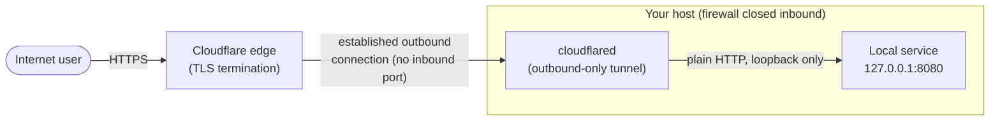

# cloudflare-tunnel-zero-trust

[](https://github.com/shurugiken/cloudflare-tunnel-zero-trust/actions/workflows/ci.yml)

Expose a local HTTP service over HTTPS with **zero open inbound ports** using
[Cloudflare Tunnel](https://developers.cloudflare.com/cloudflare-one/connections/connect-networks/)
(`cloudflared`) managed as a hardened `systemd` service.

## The problem

You have a service running on a homelab box, a dev VM, or a Raspberry Pi —
say a small API on `127.0.0.1:8080` — and you want to reach it over the public
internet. The traditional answer is to:

- forward a port on your router,
- punch a hole in the firewall,
- expose the host's public IP,
- and run (and renew) your own TLS certificate.

Every one of those steps adds attack surface. An open inbound port is
discoverable, scannable, and one misconfiguration away from being a problem.

Cloudflare Tunnel flips the model. `cloudflared` makes an **outbound-only**
connection from your box to Cloudflare's edge and holds it open. Public traffic
arrives at Cloudflare, is terminated and inspected there, and is then pushed
down that existing outbound connection to your local service. Your host never
listens on a public port — the firewall stays fully closed inbound.

## Architecture



The arrow from the edge to `cloudflared` rides the connection that
`cloudflared` itself opened. Nothing initiates a connection *into* your host.

## Quick tunnel vs named tunnel

| | Quick tunnel | Named tunnel |
|---|---|---|
| Setup | One command, no account login | Create tunnel + token in dashboard |
| Hostname | Random `*.trycloudflare.com`, changes each run | Stable hostname you control (your domain) |
| Auth to Cloudflare | None | Tunnel token (credential) |
| Persistence | Ephemeral — gone when process stops | Durable, survives restarts |
| Zero Trust / Access policies | Not supported | Supported (layer auth in front) |
| Good for | Quick demos, sharing a dev server | Anything you run continuously |

This repo ships a **quick tunnel** by default so you can see it working in under
a minute, with commented lines in the unit file showing exactly how to switch to
a named tunnel for production.

## Security benefits

- **No inbound ports.** Your firewall stays closed inbound. There is nothing on
  your public IP to scan, fingerprint, or brute-force.
- **TLS terminated at the edge.** Cloudflare presents and renews the public
  certificate. You never manage cert files, and the local hop stays on loopback.
- **Outbound-only connection.** `cloudflared` dials out; the edge never dials
  in. This works behind NAT and CGNAT without any router configuration.
- **Layer Zero Trust auth in front.** With a named tunnel you can put
  [Cloudflare Access](https://developers.cloudflare.com/cloudflare-one/policies/access/)
  in front of the hostname and require SSO / one-time PIN / device posture
  *before* a request ever reaches your service — identity-aware access without
  touching your app.
- **Least-exposure local binding.** The example service binds to `127.0.0.1`,
  so it is reachable only by `cloudflared` on the same host, never on the LAN.

## Setup

> Tested on Debian/Ubuntu with `systemd`. Run as root (or with `sudo`).

### 1. Install `cloudflared`

```bash
sudo ./install.sh
```

This detects your CPU architecture (`x86_64` / `aarch64`), downloads the
official static `cloudflared` binary to `/usr/local/bin`, marks it executable,
and prints the version. It is idempotent — re-running it just refreshes the
binary.

### 2. Start the example service

In one terminal, run the demo backend so the tunnel has something to point at:

```bash
python3 example-service.py
```

It serves a small JSON payload on `127.0.0.1:8080`. Confirm it locally:

```bash
curl http://127.0.0.1:8080/
# {"service": "example-service", "status": "ok", "path": "/"}
```

### 3. Install and start the tunnel service

```bash
sudo cp service-tunnel.service /etc/systemd/system/
sudo systemctl daemon-reload
sudo systemctl enable --now service-tunnel.service
```

### 4. Get your public URL

The quick tunnel prints a `https://<random>.trycloudflare.com` URL on startup.
Read it from the logs:

```bash
sudo journalctl -u service-tunnel.service -f
```

Open that URL in a browser — you are now hitting your `127.0.0.1:8080` service
over HTTPS, with no inbound port open on your host.

## Production notes

**Use a named tunnel for a stable hostname.** Quick tunnels get a fresh random
hostname on every restart, which is fine for demos but not for anything you rely
on. Create a named tunnel in the Cloudflare Zero Trust dashboard, copy its
token, and switch the unit's `ExecStart` to the token form (commented in
`service-tunnel.service`):

```ini
ExecStart=/usr/local/bin/cloudflared tunnel --no-autoupdate run --token <TUNNEL_TOKEN>
```

Don't paste the token directly into the unit file in production. Put it in a
root-only environment file and load it:

```ini
EnvironmentFile=/etc/cloudflared/tunnel.env   # contains TUNNEL_TOKEN=...
ExecStart=/usr/local/bin/cloudflared tunnel --no-autoupdate run
```

```bash
sudo install -m 600 -o root -g root /dev/null /etc/cloudflared/tunnel.env
# then write TUNNEL_TOKEN=... into it
```

**Layer authentication.** Once you have a named hostname, add a Cloudflare
Access application in front of it so visitors must authenticate before the
request reaches your service.

**Harden the systemd unit.** The shipped unit includes commented hardening
directives; enable them in production:

| Directive | Effect |
|---|---|
| `NoNewPrivileges=true` | Process can never gain new privileges via setuid/setgid |
| `ProtectSystem=strict` | Mounts most of the filesystem read-only |
| `ProtectHome=true` | Hides `/home`, `/root`, `/run/user` from the process |
| `PrivateTmp=true` | Gives the service a private `/tmp` |
| `DynamicUser=true` | Runs under a transient unprivileged user |
| `RestrictAddressFamilies=AF_INET AF_INET6` | Limits the service to IP sockets |

Apply with `sudo systemctl daemon-reload && sudo systemctl restart service-tunnel.service`,
and verify exposure with `systemd-analyze security service-tunnel.service`.

## License

[MIT](LICENSE)
